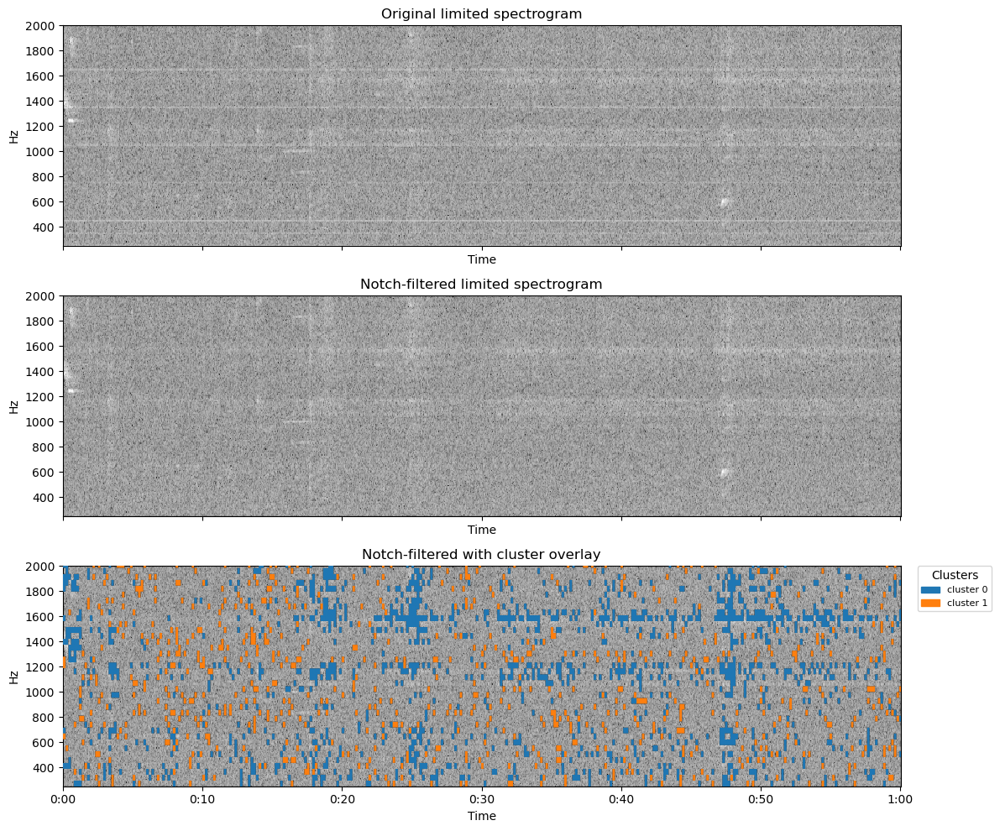

# Sound data clustering
**Description** 

This code analyzes sound data using PCA, UMAP, and HDBSCAN. As a result, the sound data is separated into background noise and meaningful sound data for further analysis, and the result is plotted. This analysis is intended for pure data analysis, not audible sound processing. For data preprocessing, a multi-band notch filter is integrated to reduce static noise (hum noise).

**Required Python packages**

[librosa](https://github.com/librosa) \
[matplotlib](https://github.com/matplotlib/matplotlib) \
[scikit-learn](https://github.com/scikit-learn/scikit-learn) \
[scikit-image](https://github.com/scikit-image/scikit-image) \
[SciPy](https://github.com/scipy/scipy) \
[pandas](https://github.com/pandas-dev/pandas) \
[hdbscan](https://github.com/scikit-learn-contrib/hdbscan) \
[umap](https://github.com/lmcinnes/umap)

**Screenshot**

Visualizing of clusters and process

